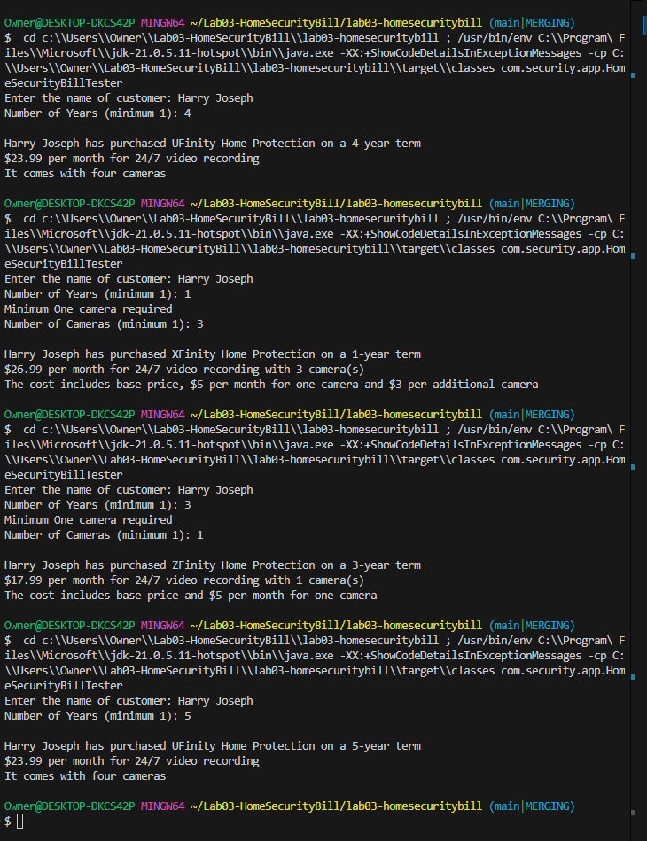

# Home Security Bill Calculator

A Java application for calculating home security system bills based on different packages and camera configurations.

## Features

- Calculate monthly charges for home security packages
- Support for different contract terms (1-4 years)
- Camera equipment pricing calculations
- Input validation for customer information
- Multiple package options (XFinity, YFinity, ZFinity, UFinity)

## Package Details

- **1-year term (XFinity)**: $15.99/month base price
- **2-year term (YFinity)**: $13.99/month base price
- **3-year term (ZFinity)**: $12.99/month base price
- **4-year term (UFinity)**: $23.99/month base price (includes 4 cameras)

## Camera Pricing

For 1-3 year terms:
- First camera: $5/month
- Each additional camera: $3/month
- Minimum 1 camera required

4-year term includes 4 cameras in the base price.

## Usage

1. Run the application
2. Enter customer name
3. Select contract term (1-4 years)
4. For 1-3 year terms, specify number of cameras
5. System will calculate and display total monthly charges

## Input Validation

The system includes validation for:
- Customer name (non-empty string)
- Contract term (1-4 years)
- Camera count (minimum 1 for 1-3 year terms)

## Modules

### 1. HomeSecurityBill
**File:** [HomeSecurityBill.java](src/main/java/com/security/model/HomeSecurityBill.java)

**Description:** 
The `HomeSecurityBill` class stores customer and contract information. It calculates the monthly price and total contract value based on the selected package and the number of cameras. It also provides methods to get user input and display a summary of the bill.

### 2. HomeSecurityBillTester
**File:** [HomeSecurityBillTester.java](src/main/java/com/security/app/HomeSecurityBillTester.java)

**Description:** 
The `HomeSecurityBillTester` class is the main application class. It prompts the user for input, creates a `HomeSecurityBill` object, and displays the final bill summary. It also handles user confirmation and error display.

### 3. HomeSecurityInputvalidation
**File:** [HomeSecurityInputvalidation.java](src/main/java/com/security/app/validation/HomeSecurityInputvalidation.java)

**Description:** 
The `HomeSecurityInputvalidation` class provides utility methods for validating user input. It ensures that the input values for customer name, address, number of cameras, and contract years are valid. It also handles user confirmation prompts.

### 4. BillCalculator
**File:** [BillCalculator.java](src/main/java/com/security/util/BillCalculator.java)

**Description:** 
The `BillCalculator` class handles all pricing calculations. It calculates the monthly price based on the selected package and the number of cameras. It also calculates the total contract value based on the monthly price and the contract years.

## Example Output

## Output

        
    

## Directory and File Structure
<pre>
Lab02-HomeSecurityBill/
├── src/
│   ├── main/
│   │   ├── java/
│   │   │   ├── com/
│   │   │   │   ├── security/
│   │   │   │   │   ├── app/
│   │   │   │   │   │   └── HomeSecurityBillTester.java
│   │   │   │   │   ├── model/
│   │   │   │   │   │   └── HomeSecurityBill.java
│   │   │   │   │   ├── util/
│   │   │   │   │   │   └── BillCalculator.java
│   │   │   │   │   └── validation/
│   │   │   │   │       └── HomeSecurityInputvalidation.java
│   │   ├── resources/
│   │   │   └── images/
│   │   │       └── output.png
├── readme.md
</pre>

### - Author Harry Joseph [Github](https://github.com/hjoseph777)
### - January 19, 2025
